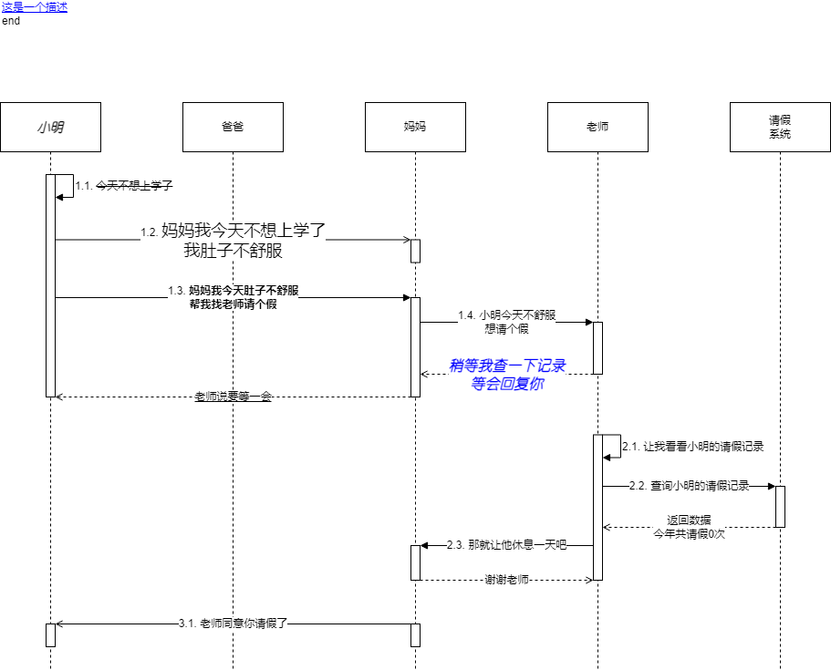
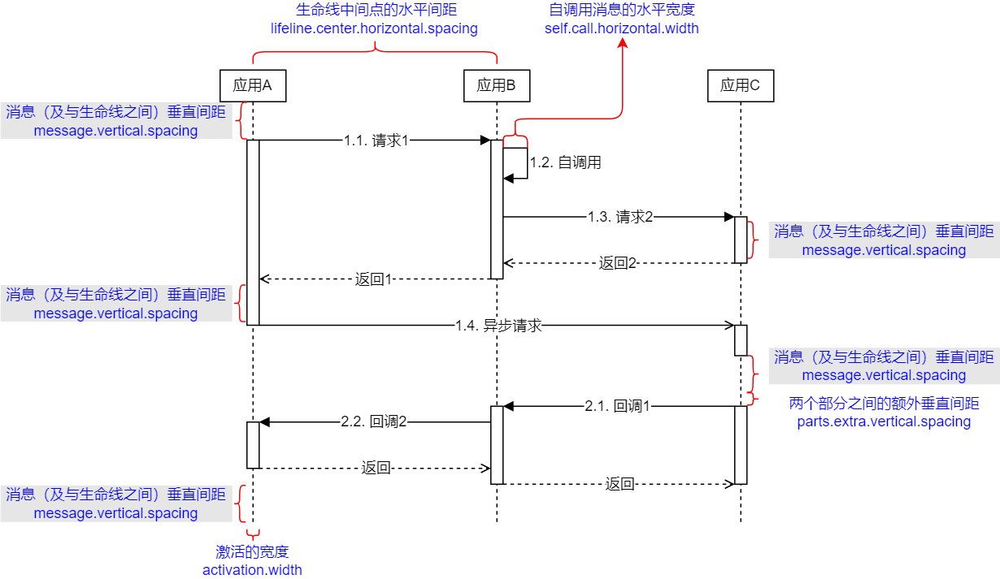

[](https://search.maven.org/artifact/com.github.adrninistrator/uml-sequence-diagram-drawio/)

[](https://github.com/Adrninistrator/uml-sequence-diagram-drawio/blob/master/LICENSE)

# 1. 前言

已有一些工具可以根据文本自动生成UML时序图，如PlantUML（[https://plantuml.com/zh/](https://plantuml.com/zh/)）、Mermaid（[https://mermaid-js.github.io/mermaid/](https://mermaid-js.github.io/mermaid/)）等。但存在一些使用不便之处，例如激活需要手工指定、语法较复杂，不便于记忆、部分功能使用频率较低、不便于人工继续编辑、展示的样式与常见的UML时序图不同等。

因此使用Java开发了以下根据文本自动生成UML时序图的工具，激活能够自动生成、语法简单便于记忆，支持大部分UML时序图的功能、生成draw.io格式文件，可以继续编辑、展示的样式与常见的UML时序图一致。

本工具生成的UML时序图相关的术语及样式参考了[https://www.uml-diagrams.org/sequence-diagrams.html](https://www.uml-diagrams.org/sequence-diagrams.html)，支持的元素包括：生命线（Lifeline）、激活（Execution/Activation）、消息（Message）。

`当前项目可用于为Java代码自动生成UML时序图`，可参考[https://github.com/Adrninistrator/gen-java-code-uml-sequence-diagram](https://github.com/Adrninistrator/gen-java-code-uml-sequence-diagram)。

# 2. 示例

以下为本工具生成的draw.io格式的UML时序图：



生成以上UML时序图的文本如下：

```
>><font color="#0000ff"><u>这是一个描述</u></font><br>end~这是一个链接
@<font style="font-size: 17px" face="幼圆" color="#000000"><b><i>小<br>明</i></b></font> as xm
@爸爸
@妈妈 as mm
@老师
@请假<br>系统 as qjxt
xm=>xm:<strike>今天不想上学了</strike>
xm->妈妈:<font style="font-size: 18px" face="微软雅黑" color="#000000">妈妈我今天不想上学了<br>我肚子不舒服</font>
xm=>mm:			<b>妈妈我今天肚子不舒服<br>帮我找老师请个假</b>
mm=>老师:小明今天不舒服<br>想请个假
妈妈<=老师:<font style="font-size: 16px" face="幼圆" color="#0000ff"><b><i>稍等我查一下记录<br>等会回复你</i></b></font>
xm<=妈妈:<u>老师说要等一会</u>

老师=>老师:让我看看小明的请假记录~https://www.baidu.com
老师=>qjxt:查询小明的请假记录
老师<=请假<br>系统:返回数据<br>今年共请假0次
老师=>妈妈:那就让他休息一天吧
老师<=妈妈:谢谢老师

妈妈->xm:老师同意你请假了
```

`默认会为每个消息自动添加序号，可以通过后续说明的配置关闭。`

`将鼠标移到生命线或激活上方后，会显示对应生命线的描述，便于在时序图较长时查看。`

# 3. 根据文本文件生成UML时序图

本工具代码地址为： [https://github.com/Adrninistrator/uml-sequence-diagram-drawio/](https://github.com/Adrninistrator/uml-sequence-diagram-drawio/) 。

## 3.1. 使用方式

使用本工具的操作系统中需要安装JDK，并在环境变量中配置对应目录。

### 3.1.1. 通过命令行执行

可从以下地址下载本工具并解压：

[https://github.com/Adrninistrator/uml-sequence-diagram-drawio/releases/](https://github.com/Adrninistrator/uml-sequence-diagram-drawio/releases/)

在Windows环境执行时，可在命令行执行以下命令，参数1为文本文件路径（可在资源管理器中将文件拖放到命令行窗口中）：

```
run.bat [文本文件路径]
```

在Linux等环境执行时，可在命令行执行以下命令，参数1为文本文件路径：

```
sh run.sh [文本文件路径]
```

执行完毕后，会在文本文件路径所在目录下生成对应的draw.io格式的UML时序图文件。

### 3.1.2. 在Java项目中执行

在Java项目中执行本工具时，可以通过以下方式引入本工具：

- Gradle

```
testImplementation 'com.github.adrninistrator:uml-sequence-diagram-drawio:0.0.4'
```

- Maven

```xml
<dependency>
  <groupId>com.github.adrninistrator</groupId>
  <artifactId>uml-sequence-diagram-drawio</artifactId>
  <version>0.0.4</version>
  <type>provided</type>
</dependency>
```

执行com.adrninistrator.usddi.runner.RunnerGenUmlSequenceDiagram类，generate()方法，可以根据指定的文本文件，生成对应的draw.io格式的UML时序图文件。

## 3.2. 输入文本要求

### 3.2.1. 输入文本关键字

以下关键字用于指定描述：

```
>>
```

以下关键字用于指定生命线的名称：

```
@
as
```

以下关键字用于指定消息：

```
=>
<=
->
:
```

以下关键字用于对描述或消息指定链接：

```
~
```

以下关键字用于指定注释：

```
#
```

### 3.2.2. 输入文本格式

#### 3.2.2.1. 描述格式

描述是指时序图最上部用于说明的文字，与时序图没有关联，仅起说明作用。

- \>\>description

使用“\>\>description”格式指定描述，“description”为描述的内容，可指定任意内容；

描述需要在输入文本的最前面指定，只能指定一个描述，也可以不指定。

可使用HTML标签设置描述内容的样式，如换行等，可参考后续内容。

##### 3.2.2.1.1. 链接格式

- \>\>description~link

使用“~link”格式指定描述对应的链接，“link”为链接的内容；

点击指定了链接的描述内容后，会显示对应的链接，如下所示：


链接内容可以指定为一般的文字，也可以指定为URL或文件路径（file://），如下所示：

```
file://C:\Windows\System32\calc.exe
file://C:\Windows\system.ini
https://www.baidu.com
```

当链接内容指定为URL时，点击链接时会使用默认浏览器打开对应URL；

当链接内容指定为文件路径，点击链接时会使用对应文件格式的默认软件打开文件，若对应文件格式未指定默认软件，则不会打开，需要先设置。

#### 3.2.2.2. 生命线格式

在输入文本中前面的内容（若有指定描述，则在描述之后），使用以下格式指定生命线，生命线在输入文本中出现的顺序（从上往下）与在UML时序图中的展示顺序（从左往右）一致。

- @name

使用“@name”格式指定生命线，“name”为生命线的名称；

- @name as alias

为了简化生命线名称，可使用“@name as alias”格式指定生命线的名称，及别名，“alias”为生命线的别名；

#### 3.2.2.3. 消息格式

在输入文本中后面面的内容，使用以下格式指定消息，消息在输入文本中出现的顺序（从上往下）与在UML时序图中的展示顺序（从上往下）一致。

- x=>y:m~L

使用“x=>y:m~L”格式指定同步请求消息；

“x”为起点生命线的名称或别名，“y”为终点生命线的名称或别名，“m”为消息内容；

- x<=y:m~L

使用“x<=y:m~L”格式指定返回消息；

“y”为起点生命线的名称或别名，“x”为终点生命线的名称或别名，“m”为消息内容；

同步请求消息与返回消息需要在正确的位置成对出现；

- x=>x:m~L

使用“x=>x:m~L”格式指定自调用消息；

“x”为生命线的名称或别名，“m”为消息内容；

- x->y:m~L

使用“x->y:m~L”格式指定异步消息；

“x”为起点生命线的名称或别名，“y”为终点生命线的名称或别名，“m”为消息内容；

##### 3.2.2.3.1. 链接格式

以上消息内容中的“L”为链接，可以不指定，格式已在前文说明；

为消息指定链接后的示例如下：


#### 3.2.2.4. 注释格式

在输入文本中，以“#”开头的行代表注释。

#### 3.2.2.5. 时序图开始新的阶段格式

有时可能需要在一个时序图中展示多个不同阶段的时序图，例如在阶段1中消息最初的起点对应生命线1，在阶段2中消息最初的起点对应生命线2，在这种情况下，可在每个阶段的消息之间指定一个或多个空行，如下所示：

```
阶段1消息
阶段1消息
...
阶段1消息

阶段2消息
阶段2消息
...
阶段2消息
```

### 3.2.3. 输入文本编码

输入文本文件编码需要是UTF-8。

## 3.3. 参数配置

### 3.3.1. 位置相关参数

位置相关参数在配置文件“~usddi_conf/position.properties”中指定，如下所示：

|参数名称|参数作用|是否允许为空|默认值|
|---|---|---|---|
|lifeline.center.horizontal.spacing|生命线中间点的水平间距|非空|无|
|lifeline.box.width|生命线的方框宽度|非空|无|
|lifeline.box.height|生命线的方框高度|非空|无|
|message.vertical.spacing|消息（及与生命线之间）垂直间距|非空|无|
|rsp.message.vertical.spacing|消息请求及返回（自调用）的垂直间距|非空|无|
|self.call.horizontal.width|自调用消息的水平宽度|非空|无|
|self.call.vertical.height|自调用消息的垂直高度|非空|无|
|activation.width|激活的宽度|非空|无|
|parts.extra.vertical.spacing|两个阶段之间的额外垂直间距|可选|0|

### 3.3.2. 位置相关参数示例

位置相关参数示例如下所示：



### 3.3.3. 样式相关参数

样式相关参数在配置文件“~usddi_conf/style.properties”中指定，如下所示：

|参数名称|参数作用|是否允许为空|默认值|
|---|---|---|---|
|message.auto.seq|自动为消息添加序号|可选|是|
|line.width.of.lifeline|线条宽度-生命线|可选|1|
|line.width.of.activation|线条宽度-激活|可选|1|
|line.width.of.message|线条宽度-消息|可选|1|
|line.color.of.lifeline|线条颜色-生命线|可选|黑色|
|line.color.of.activation|线条颜色-激活|可选|黑色|
|line.color.of.message|线条颜色-消息|可选|黑色|
|box.color.of.lifeline|方框背景颜色-生命线|可选|白色|
|box.color.of.activation|方框背景颜色-激活|可选|白色|
|text.font.of.lifeline|文字字体-生命线|可选|Helvetica|
|text.font.of.message|文字字体-消息|可选|Helvetica|
|text.size.of.lifeline|文字大小-生命线|可选|12|
|text.size.of.message|文字大小-消息|可选|12|
|text.color.of.lifeline|文字颜色-生命线|可选|黑色|
|text.color.of.message|文字颜色-消息|可选|黑色|

颜色相关的参数，应为RGB颜色十六进制形式，即“#xxxxxx”，如“#00ff00”；

文字字体相关的参数，应指定字体的名称，如“宋体”、“Times New Roman”；

线条宽度相关的参数，支持整数或小数；

文字大小相关的参数，支持整数。

## 3.4. 为某个生命线名称、消息内容文字指定样式

以上样式相关参数是对一个UML时序图内统一的参数配置，当需要为某个生命线名称、消息内容文字单独指定样式时，可以按照以下方式实现：

### 3.4.1. 文字字体、大小、颜色

文字字体、大小、颜色可通过HTML中的font标签进行设置，如下所示：

```html
<font face="宋体" style="font-size: 18px" color="#ff9999" >xxx</font>
```

- 文字字体

```html
<font face="宋体">xxx</font>
```

- 文字大小

```html
<font style="font-size: 18px">xxx</font>
```

- 文字颜色

```html
<font color="#ff9999" >xxx</font>
```

### 3.4.2. 加粗、斜体、下划线、删除线

文字加粗、斜体、下划线、删除线可通过HTML中的标签进行设置，如下所示：

- 加粗

```html
<b>xxx</b>
```

- 斜体

```html
<i>xxx</i>
```

- 下划线

```html
<u>xxx</u>
```

- 删除线

```html
<strike>xxx</strike>
```

- 多个样式

```html
<b><i><u><strike>xxx</strike></u></i></b>
```

同时指定文字字体、大小、颜色，及加粗、斜体、下划线、删除线时，如下所示：

```html
<font face="宋体" style="font-size: 18px" color="#ff9999" ><b><i><u><strike>xxx</strike></u></i></b></font>
```

### 3.4.3. 文字换行

当需要使文字换行时，使用以下内容作为换行符：

```
<br>
```

# 4. 通过Java方法生成UML时序图

调用上述Java组件提供的RunnerGenTextFile4USD类，可以生成用于生成UML时序图的文本文件，再根据文本文件生成UML时序图，该类提供的方法说明如下：

|方法名|功能|
|---|---|
|init|初始化|
|writeDescription|设置描述|
|writeComment|添加注释|
|addReqMessage|添加同步请求消息|
|addRspMessage|添加返回消息|
|addSelfCallMessage|添加自调用消息|
|addAsyncMessage|添加异步请求消息|
|write2File|将添加的数据写入文件|

在使用RunnerGenTextFile4USD类时，需要先调用init方法，指定需要生成的文本文件路径，之后根据需要添加注释或消息，最后调用write2File方法将添加的数据写入文件。

RunnerGenTextFile4USD类的使用示例如下所示，可参考test.usddi.gen_text_file.TestGenTextFile4USD类。

```java
String filePath = "test-" + System.currentTimeMillis() + ".txt";
System.out.println(filePath);

RunnerGenTextFile4USD runnerGenTextFile4USD = new RunnerGenTextFile4USD();

try (BufferedWriter writer = runnerGenTextFile4USD.init(filePath)) {
    // 设置描述
    runnerGenTextFile4USD.writeDescription("description", "descriptionLink");

    // 添加注释
    runnerGenTextFile4USD.writeComment("111");
    runnerGenTextFile4USD.writeComment("222");
    runnerGenTextFile4USD.writeComment("333");

    // 添加不同类型的消息
    runnerGenTextFile4USD.addReqMessage("a", "b", "请求1");
    runnerGenTextFile4USD.addRspMessage("a", "b", "返回1");
    runnerGenTextFile4USD.addSelfCallMessage("a", "自调用1<br>aaa");
    runnerGenTextFile4USD.addAsyncMessage("a", "c", "异步请求1<br>bbb");

    // 将添加的数据写入文件
    runnerGenTextFile4USD.write2File();

    // 根据文本生成UML时序图文件
    new RunnerGenUmlSequenceDiagram().generate(filePath, filePath + USDDIConstants.EXT_DRAWIO);
} catch (Exception e) {
    e.printStackTrace();
}
```

# 5. 生成的.drawio文件使用方式

## 5.1. 直接打开.drawio文件

从以下地址可以下载draw.io桌面版软件：

[https://github.com/jgraph/drawio-desktop/releases](https://github.com/jgraph/drawio-desktop/releases)

本工具生成的.drawio文件可使用draw.io软件打开并编辑。

## 5.2. 复制.drawio文件的XML内容

复制本工具生成的.drawio文件的XML内容，在draw.io桌面版或网页版中，打开“其他->编辑绘图”，或“Extras->Edit Diagram”菜单，可以粘贴到当前打开的draw.io文件中。